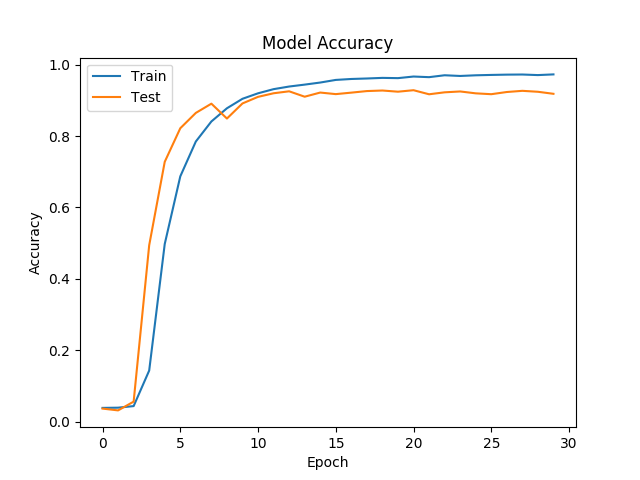

# Vocalization Sign Language iOS
### By Arda Mavi & Zeynep Dikle

Vocalization sign language iOS App with deep learning.

Download iOS App from App Store: [Sesgoritma](https://itunes.apple.com/us/app/sesgoritma/id1369560353?mt=8)

### The under construction!
### Documentation coming soon!

|Demo|
|:-:|
||
|[Watch Demo Videos &#128266; ](https://github.com/ardamavi/Vocalization-Sign-Language-iOS/tree/master/Assets)|

In this project we create iOS app for our [Vocalize Sign Language](https://github.com/ardamavi/Vocalize-Sign-Language) project using CoreML with Swift.

### Published `DataSet` and `Deep Learning Model`:
For more details of `Deep Learning` model, look up our [github.com/ardamavi/Vocalize-Sign-Language](https://github.com/ardamavi/Vocalize-Sign-Language) project.

We use our own [Sign Language Digits Dataset](https://github.com/ardamavi/Sign-Language-Digits-Dataset).

### New dataset is available on Kaggle: [ 27 Class Sign Language Dataset - Kaggle](https://www.kaggle.com/ardamavi/27-class-sign-language-dataset)
### Used `(Updated) Model` coming soon!

|DataSet Examples|Model Accuracy|
|:-:|:-:|
|||

## Important Notes:
- If you want to use `Keras2CoreML`, Install necessary modules with `sudo pip3 install -r requirements.txt` command.
### Used Versions:
- Swift: 4.0
- XCode: 9.3
- iOS: 11.3 (iPhone 6)
- coremltools: 0.8
- Keras: 2.1.5
- TensorFlow: 1.1.0
